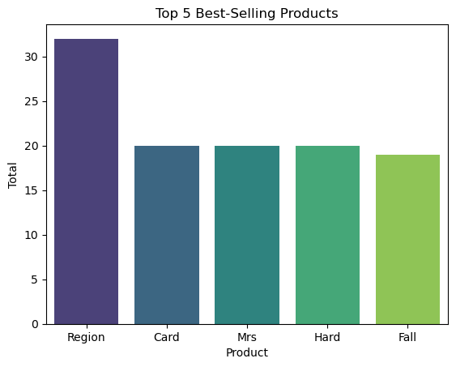
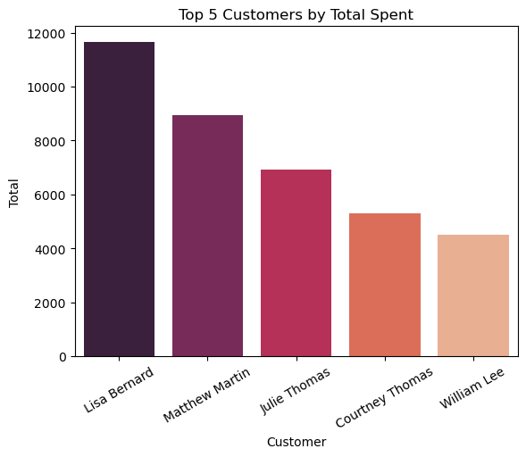
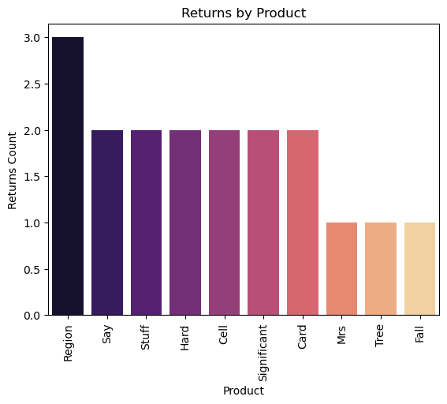

# 🛍️ Shop Data Generator & Analysis

Проект по созданию и анализу базы данных интернет-магазина с использованием PostgreSQL, SQLAlchemy и Jupyter Notebook.

---

## 📌 Описание

Этот проект моделирует работу интернет-магазина: клиенты, заказы, товары, возвраты, скидки и платежи.  
Всё реализовано в Jupyter Notebook — от генерации данных до аналитических SQL-запросов.

---

## 🧰 Используемые технологии

- Python 3.10+
- PostgreSQL
- SQLAlchemy (ORM)
- Pandas
- Faker (для генерации фейковых данных)
- Jupyter Notebook

---

## 📊 Визуализации

### 📌 Топ 5 товаров по количеству продаж


---

### 📌 Топ 5 покупателей по сумме покупок


---

### 🔄 Возвраты по товарам



---


## 🗂 Структура проекта

```bash
├── Data_Generator&Analysis.ipynb       # Основной Jupyter ноутбук с кодом и анализом
└── README.md            
```

## ⚙️ Установка и запуск

### 🔄 Клонирование  папки `BD_Shope`

```bash
git clone --filter=blob:none --sparse https://github.com/Spa-rrow7/data-science-portfolio.git
cd data-science-portfolio
git sparse-checkout set BD_Shope
cd BD_Shope
```
## 🚀 Запуск Jupyter Notebook
```bash
jupyter notebook
```