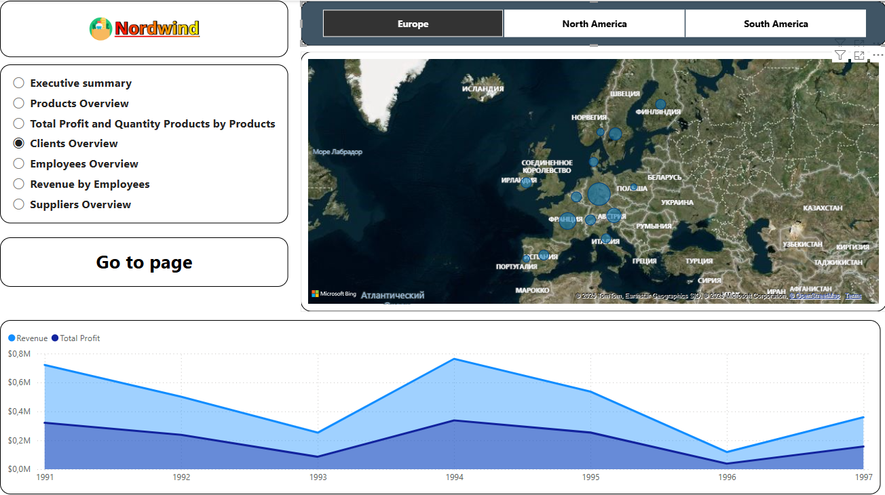

# 📊 Northwind Sales Dashboard (Power BI)

### 🧩 Описание проекта

Интерактивный дашборд в Power BI, построенный на основе тренировочной базы данных **Northwind**, предоставленной YugabyteDB.

Проект демонстрирует навыки работы с Power BI: подключение к базе данных, создание моделей данных, расчет метрик с помощью **мер (DAX)** и построение визуализаций для анализа ключевых бизнес-показателей.

---

### 🗃 Источник данных

База данных: [Northwind Sample DB](https://docs.yugabyte.com/preview/sample-data/northwind/)  
Тип подключения: **PostgreSQL**

Использованные таблицы:
- `Orders`
- `Order_Details`
- `Products`
- `Categories`
- `Customers`
- `Employees`
- `Shippers`

---

### 📈 Основные визуализации

- Продажи по категориям товаров
- Продажи по странам и городам
- Динамика заказов по дате
- Топ-10 клиентов по выручке
- KPI-панель: общая выручка, средний чек, количество заказов
- Эффективность сотрудников

---

### 📐 Расчеты и метрики

Для расчета показателей использовались **меры (DAX)**, включая:
- Общую выручку
- Количество уникальных заказов
- Средний доход на заказ
- Количество товаров в заказе
- Доли категорий в продажах

---

### 🛠 Инструменты

- **Power BI Desktop** — визуализация и моделирование данных  
- **DAX** — расчеты и меры  
- **GitHub** — управление версионированием  
- **PostgreSQL** — источник данных (через Power BI connector)

---

### 🖼 Превью отчёта

